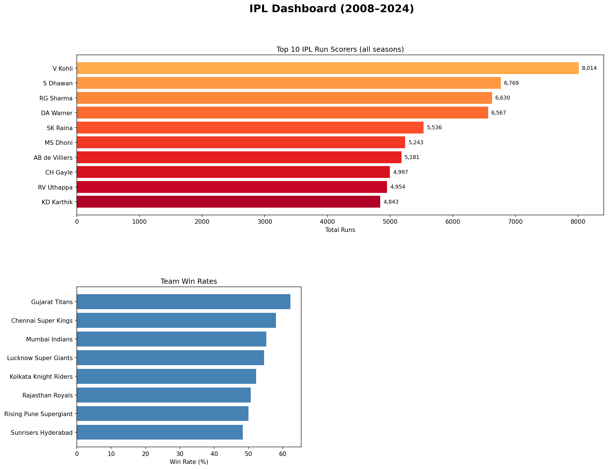

# 🏏 IPL Sports Dashboard

A data analysis project built using Python to analyse IPL match data from 2008 to 2024.

## 📊 What this project does
- Loads and cleans ball-by-ball IPL delivery data
- Identifies top run scorers across all seasons
- Calculates team win rates
- Visualises season-wise run trends
- Builds a multi-panel dashboard chart

## 🛠️ Tools Used
- Python
- pandas
- matplotlib

## 📁 Dataset
Download the dataset from Kaggle:
👉 https://www.kaggle.com/datasets/patrickb1912/ipl-complete-dataset-20082020

Place the files inside a `data/` folder after downloading.

## 📸 Dashboard Output


## ▶️ How to run
```bash
pip install pandas numpy matplotlib
python analysis.py
```
